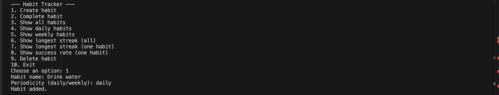
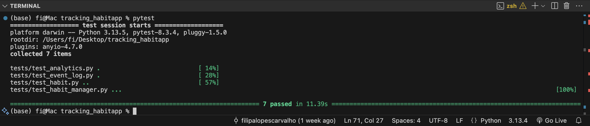

# Habit Tracker App

A Python-based habit tracking application developed using object-oriented and functional programming principles. The application allows users to create, manage, track, and analyse habits using a command-line interface (CLI).

---

# Features

- Create and manage habits
- Track daily and weekly habits
- Record habit completions with timestamps
- Analyse habits using streak calculations and success rates
- Command Line Interface (CLI)
- Data persistence using JSON
- Automated testing using `pytest`
- Predefined habits with 4-week dummy test data

---

# Technologies Used

- Python 3
- Object-Oriented Programming (OOP)
- Functional Programming (analytics)
- JSON for storage
- Pytest for testing

---

# Project Structure

```text
models/
services/
storage/
analytics/
tests/
```

---

# How to Run the Application

```bash
python main.py
```

---

# Running Tests

```bash
python -m pytest
```

---

# Future Improvements

- Graphical user interface (GUI)
- Web-based interface
- Relational database integration
- Advanced analytics and reporting

# Screenshots

## CLI Example 



## Pytest Results

